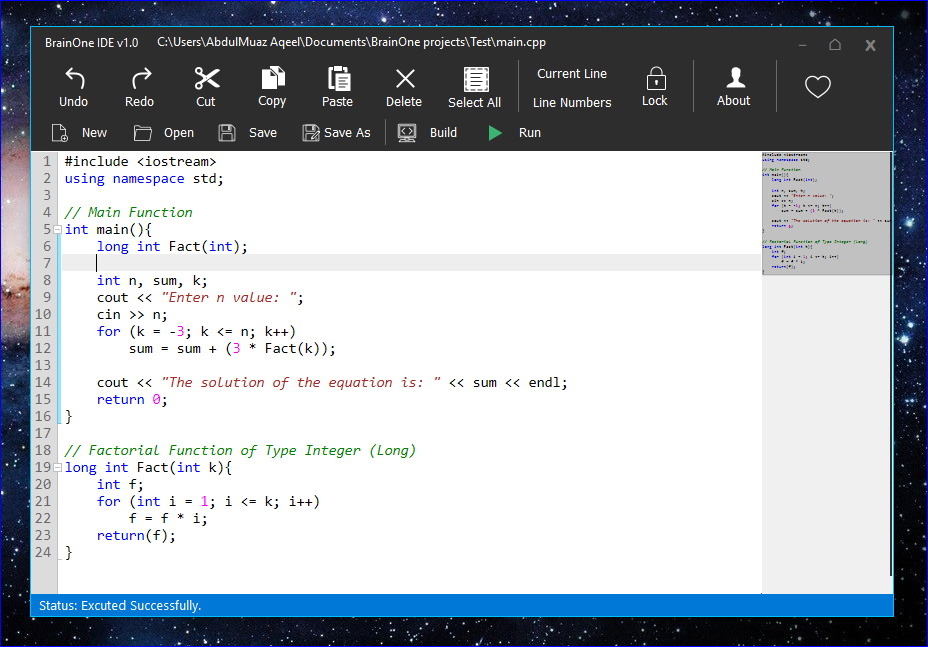
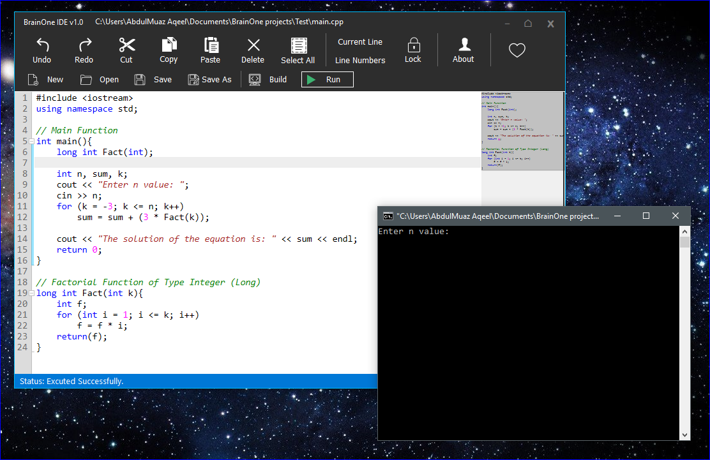
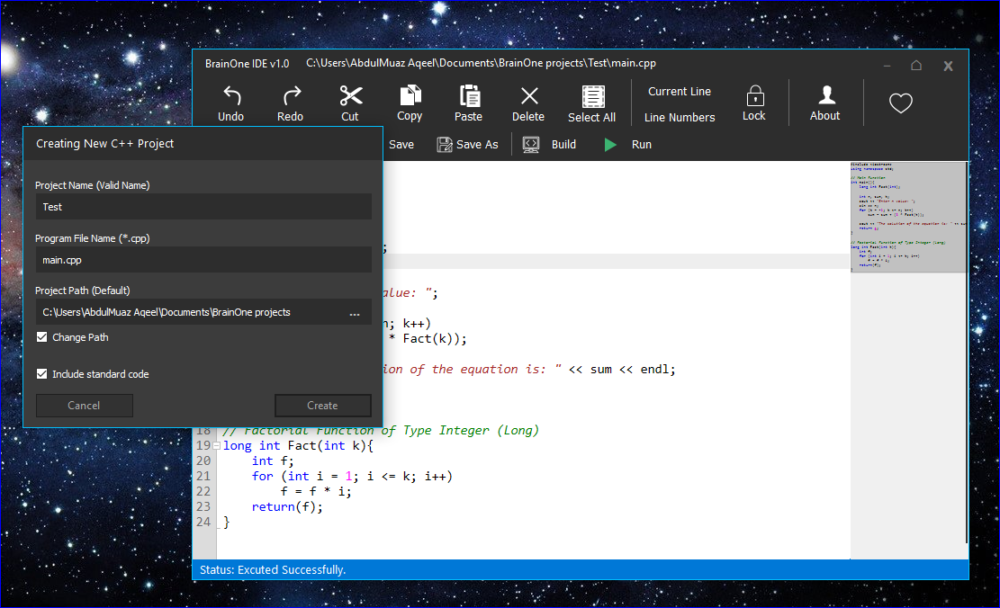

# BrainOne IDE
Is basically an easy, simple UI, fast and reliable Windows app built using C# language.
# Download Executable File
You can see my personal blog, there is a video tutorial of how to install BrainOne IDE on windows OS..
also the C++/C compiler under the free license.

See this http://abdulmuazaqeel.blogspot.com/2017/06/BrainOne-IDE.html

## Previews
 

  
   
  
   
  

 
 

## Enjoy.
